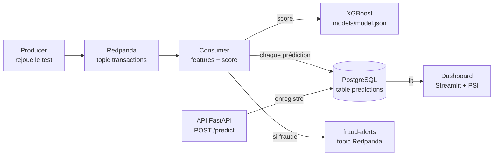

# Real-Time Fraud Detection Pipeline

Pipeline complet de détection de fraude sur paiements par carte : un modèle XGBoost note chaque
transaction en quelques millisecondes, les prédictions sont enregistrées dans PostgreSQL, les
fraudes sont publiées dans un topic d'alertes et un dashboard suit l'activité et la dérive.

## Architecture



| Brique | Rôle |
|---|---|
| XGBoost | Calcule le score de fraude |
| FastAPI | Expose le modèle (`POST /predict`, `GET /health`) |
| Redpanda (Kafka) | Transporte les transactions en continu |
| Producer | Rejoue les transactions du jeu de test |
| Consumer | Lit le flux, appelle le modèle, enregistre, alerte |
| PostgreSQL | Garde chaque prédiction |
| Streamlit + PSI | Affiche l'activité, les KPI métier et la dérive |

## Résultats

Jeu de données : *Credit Card Fraud Detection* (ULB), 284 807 transactions dont 492 fraudes (0,173 %).
Split temporel 60 % / 20 % / 20 % (entraînement / validation / test). Le seuil est choisi sur la
validation (précision visée : 90 %), jamais sur le test.

| Mesure | Baseline (régression logistique) | XGBoost |
|---|---|---|
| PR-AUC (test) | 0,696 | 0,799 |
| Précision (test, seuil à 90 % sur la validation) | 83 % | 90 % |
| Rappel (test, même seuil) | 45 % | 75 % |
| Latence de scoring p50 / p95 | n/a | 2,2 ms / 2,7 ms |
| Débit de scoring (1 processus) | n/a | 437 tx/s |
| Débit de bout en bout (Redpanda → score → Postgres) | n/a | 229 tx/s |

Mesures de latence et de débit sur un AMD Ryzen 7 7735HS (16 threads logiques), Windows 11.

### Dérive (PSI)

| Scénario | PSI Amount | PSI score |
|---|---|---|
| Rejeu normal | 0,008 (stable) | 0,120 (à surveiller) |
| Montants multipliés par 3 | 0,480 (dérive importante) | 0,162 (à surveiller) |

Le PSI du score bouge beaucoup moins que celui du montant : le modèle s'appuie surtout sur V1 à V28.
La dérive des entrées ne dégrade pas toujours les sorties, d'où l'intérêt de surveiller les deux.
Le PSI du score est déjà à 0,12 en rejeu normal : la période de test est différente de la période
d'entraînement (split temporel), ce qui est attendu.

### Volet métier : choisir le seuil par le coût

Une fraude ratée coûte son montant ; une fausse alerte coûte un frais fixe (hypothèse : 10 €,
modifiable dans [config.json](config.json) sans réentraîner le modèle). Résultats sur le test, pour
100 000 transactions, avec le seuil à 90 % de précision :

| KPI | Valeur |
|---|---|
| Argent économisé | 7 083 € |
| Clients honnêtes bloqués | 10,5 |
| Fraudes détectées | 74,7 % |
| Montants fraudés détectés | 53,0 % |

Le détail du balayage du frais de fausse alerte (2 à 50 €) est dans
[reports/business_threshold_sweep.json](reports/business_threshold_sweep.json) :
le seuil qui minimise le coût sur la validation **n'est pas stable** avec ce modèle (il passe de
0,017 à 0,959 selon le frais). La validation ne contient que quelques dizaines de fraudes, donc un
seuil réglé sur le coût y sur-apprend facilement. C'est pourquoi le seuil retenu pour le service
reste celui à 90 % de précision, et pourquoi il faut suivre le nombre de clients bloqués à côté des euros.

## Exploration des données

1. **Déséquilibre extrême** : 0,173 % de fraudes. L'accuracy est inutile (« toujours normal » = 99,8 %), on mesure le PR-AUC.
2. **Montants** : la fraude médiane (9,25) est plus petite que la transaction normale médiane (22,00).
3. **Heures** : environ 0,73 % de fraudes la nuit (1 h à 5 h) contre 0,14 % en journée (9 h à 21 h).

Détail et graphiques : [notebooks/01_eda.ipynb](notebooks/01_eda.ipynb), [reports/eda/](reports/eda/).

## Lancer le projet

Prérequis : Docker, Python 3.11 et le fichier `data/creditcard.csv` (non versionné) :

```bash
mkdir -p data && curl -L -o data/creditcard.csv \
  https://storage.googleapis.com/download.tensorflow.org/data/creditcard.csv
```

```bash
# 1. Tout démarrer (Postgres, Redpanda, API, consumer, dashboard)
docker compose up --build -d
docker compose exec redpanda rpk topic create transactions fraud-alerts

# 2. Envoyer des transactions depuis le terminal (vers localhost:19092)
pip install -r requirements.txt
python -m src.producer --rate 100
```

- API : http://localhost:8000/docs
- Dashboard : http://localhost:8501
- Postgres côté hôte : port **5433** (pour ne pas entrer en conflit avec un Postgres local).

Réentraîner et réévaluer le modèle :

```bash
python src/train_baseline.py   # baseline
python -m src.train            # XGBoost -> models/model.json
python -m src.evaluate         # seuil, courbes -> reports/
python -m src.business         # seuil par le coût
python -m src.benchmark        # latence et débit
python -m pytest               # tests
```

## Limites

- Variables V1 à V28 anonymisées et **pas d'identifiant de carte** : impossible de construire des features d'historique (nombre de transactions par carte sur 1 h), pourtant les plus utiles en pratique.
- Seulement 2 jours de données.
- Seuil fixé une fois pour toutes, pas de réentraînement automatique.
- Écriture ligne par ligne dans Postgres : elle limite le débit de bout en bout (écrire par lots serait une amélioration).
- Les vraies étiquettes arrivent en réalité avec des semaines de retard (litiges clients) ; ici `true_label` est connue immédiatement.
